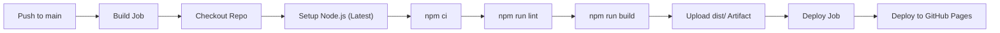

# Developer & Architecture Documentation

Comprehensive architecture, customization, and maintenance guide for the **Shashank Raj Portfolio Website** ([spoiledunknown.github.io](https://spoiledunknown.github.io)).

---

## Table of Contents

1. [Architecture Overview](#architecture-overview)
2. [Tech Stack & Dependencies](#tech-stack--dependencies)
3. [Project Directory Structure](#project-directory-structure)
4. [Component Directory & Design](#component-directory--design)
5. [Centralized Data & Content Management](#centralized-data--content-management)
6. [Design System & Theming Engine](#design-system--theming-engine)
7. [Contact Form & hCaptcha Integration](#contact-form--hcaptcha-integration)
8. [Mobile Responsiveness Engineering](#mobile-responsiveness-engineering)
9. [CI/CD Pipeline (GitHub Actions)](#cicd-pipeline-github-actions)
10. [Local Development & Maintenance Scripts](#local-development--maintenance-scripts)

---

## Architecture Overview

This portfolio is engineered as a **Pure Client-Side Static Single Page Application (SPA)** built with **Vite 8**, **Vue 3 (Composition API)**, and strict **TypeScript**.

### Architectural Tenets

- **Zero Heavy Backend Overhead**: Operates entirely as pre-compiled static HTML/CSS/JS deployable to GitHub Pages, Netlify, or any static host.
- **Obsidian Glass Design System**: Deep dark glassmorphism styling (`#0d0f14`), translucent frosted cards, subtle borders, and dynamic ambient reactive backdrops.
- **Single Source of Truth**: All dynamic content (bio, skills, projects, blogs, theme colors) is decoupled from UI presentation into typed data files in `src/data/` and `src/theme/`.
- **System Preference Intelligence**: Synchronizes with Windows/macOS/Linux system theme (dark/light) on initial arrival, responds to OS theme shifts, and preserves explicit user overrides across sessions.

---

## Tech Stack & Dependencies

| Tool / Library        | Version    | Purpose                                                           |
| :-------------------- | :--------- | :---------------------------------------------------------------- |
| **Vue**               | `^3.5.43`  | Modern reactive UI framework utilizing `<script setup>` syntax    |
| **TypeScript**        | `^5.9.3`   | Strict static typing and type safety across data and components   |
| **Vite**              | `^8.3.0`   | Ultra-fast build tool and local development server                |
| **Tailwind CSS**      | `^4.3.3`   | Utility-first styling utilizing CSS variables and modern `@theme` |
| **@tailwindcss/vite** | `^4.3.3`   | Direct Vite integration for lightning-fast CSS processing         |
| **Swiper**            | `^14.2.0`  | Touch-friendly looping slider for featured deployments & articles |
| **Web3Forms API**     | REST       | Serverless contact form transmission directly to email            |
| **hCaptcha**          | API        | Human verification bot barrier                                    |
| **ESLint**            | `^10.11.0` | Next-generation flat configuration linting                        |
| **Prettier**          | `^3.9.8`   | Code formatting consistency                                       |

---

## Project Directory Structure

```text
spoiledunknown.github.io/
├── .github/
│   └── workflows/
│       └── static.yml           # 2-stage CI/CD pipeline (Build & Deploy to Pages)
├── public/                      # Static assets served as-is at root
│   ├── links/                   # Social media icon SVGs (GitHub, Discord, etc.)
│   ├── mypic.webp               # About section profile portrait
│   ├── pfp.webp                 # Hero section circular portrait
│   ├── XtremeFPS.webp           # Project showcase media
│   ├── Richcord.webp            # Project showcase media
│   ├── newtya.webp              # Project showcase media
│   ├── cube.webp                # Project showcase media
│   └── spoiledunknown.ico       # Favicon
├── src/
│   ├── assets/
│   │   └── main.css             # Tailwind v4 import, theme tokens, and overrides
│   ├── components/              # Vue UI components
│   │   ├── HeaderNav.vue        # Floating pill navigation dock + mobile menu
│   │   ├── HeroSection.vue      # Cinematic greeting, typewriter, and photo
│   │   ├── AboutSection.vue     # Technical narrative and enlarged portrait
│   │   ├── SkillsSection.vue    # Animated skills grid with mobile dropdown
│   │   ├── ProjectsSection.vue  # Netflix-style billboard + looping carousel
│   │   ├── BlogsSection.vue     # Universal dropdown filter + article slider
│   │   ├── ContactSection.vue   # Web3Forms + responsive scaled hCaptcha
│   │   ├── FooterSection.vue    # Single-line cultural signature & copyright
│   │   ├── Preloader.vue        # Animated interactable fidget preloader
│   │   └── ThemeTransition.vue  # Circular expanding wipe theme transition
│   ├── composables/             # Reusable business logic
│   │   ├── useTheme.ts          # Dark/light theme state, OS detection & storage
│   │   ├── useTypewriter.ts     # Configurable text cycling typewriter engine
│   │   └── useScrollSpy.ts      # Active viewport section intersection tracker
│   ├── data/                    # Centralized content files
│   │   ├── profile.ts           # Bio, social links, resume URL, Web3Forms key
│   │   ├── skills.ts            # Categorized technical competencies
│   │   ├── projects.ts          # Deployments, descriptions, tags, ambient glow
│   │   └── blogs.ts             # Technical articles, devlogs, and tags
│   ├── theme/
│   │   └── colors.ts            # Centralized color theme palette definitions
│   ├── types/
│   │   └── index.ts             # TypeScript definitions and interfaces
│   ├── App.vue                  # Main application container & ambient reactor
│   └── main.ts                  # Vue application bootstrap entry
├── index.html                   # HTML template with anti-FOUC script & fonts
├── package.json                 # Dependencies and execution scripts
├── tsconfig.json                # TypeScript project configuration
└── vite.config.ts               # Vite configuration
```

---

## Component Directory & Design

### 1. `HeaderNav.vue`

- **Desktop**: Centered floating pill navbar with active section highlight, resume button (icon-only), and theme switcher.
- **Mobile (< 768px)**: Streamlined pill with only brand identity (`SR - Shashank Raj`) and a single hamburger button. Clicking opens an animated full-featured navigation menu with direct section navigation, a dedicated theme switch toggle, and resume link.

### 2. `HeroSection.vue`

- Welcoming cultural headline (`नमस्ते (Namaste)`).
- Profile picture integrated seamlessly alongside developer roles.
- `useTypewriter` engine cycling smoothly between technical specialties.

### 3. `AboutSection.vue`

- Prominent enlarged photo (`mypic.webp`) showcasing identity clearly.
- Telemetry summary card highlighting years of experience, core engine architecture, and graphics programming passion.

### 4. `SkillsSection.vue`

- Filterable technical stack cards with icon badges and proficiency tags.
- **Mobile Dropdown**: Dedicated mobile hamburger dropdown button to select categories without horizontal clutter.
- **Smooth Transitions**: Switching categories triggers CSS view transitions and staggered card entries.

### 5. `ProjectsSection.vue`

- **Spotlight Featured Billboard**: Netflix-inspired banner for flagship project (_XtremeFPS Controller_).
- **Curated Deployment Slider**: Infinite looping Swiper/CSS carousel allowing continuous navigation left or right.
- **Dynamic Ambient Reactor**: Hovering a project emits an ambient glow color matching the project's signature hue to the global backdrop.

### 6. `BlogsSection.vue`

- **Universal Filter Dropdown**: High-end dropdown filter tab (`Filter: <Category>`) featuring frosted glass styling, rotating chevrons, category icons, and active checkmarks across **all devices** (mobile, tablet, and desktop).
- **Looping Archive Slider**: Looping previous and next controls for cycling through devlogs and architectural essays.

### 7. `ContactSection.vue`

- Web3Forms API integration submitting via `multipart/form-data`.
- **Responsive hCaptcha Scaler**: Prevents the fixed-width (303px) hCaptcha iframe from breaking out of the container on narrow phone screens using adaptive CSS scaling.
- 1-click clipboard email address copy with feedback status.

### 8. `Preloader.vue`

- Interactable fidget-like animated loading sequence.
- Features a configurable delay timer (`PRELOADER_DELAY_MS = 5000`) clearly commented for easy modification.

### 9. `ThemeTransition.vue`

- Full-screen expanding radial wipe animation when toggling between Dark Mode and Light Mode.

---

## Centralized Data & Content Management

All website content is cleanly separated from component code. You can update your entire portfolio without touching HTML or CSS:

### Modifying Profile & Contact Info (`src/data/profile.ts`)

```typescript
export const profileData: Profile = {
  name: "Shashank Raj",
  handle: "@spoiledunknown",
  email: "your-email@example.com",
  web3Forms: {
    accessKey: "YOUR-WEB3FORMS-ACCESS-KEY",
    fromName: "Portfolio Contact Form",
  },
  resumeUrl: "https://your-resume-link.pdf",
};
```

### Modifying Projects (`src/data/projects.ts`)

```typescript
export const projectsData: Project[] = [
  {
    id: "my-project",
    title: "Project Title",
    tagline: "Short descriptive subtitle",
    description: "Detailed description of what the project does...",
    tags: ["Vue 3", "TypeScript", "Tailwind"],
    image: "/my-project.webp",
    githubUrl: "https://github.com/...",
    liveUrl: "https://...",
    ambientColor: "#2d68ff", // Ambient glow color
    featured: true,
  },
];
```

### Modifying Skills (`src/data/skills.ts`)

```typescript
export const skillsData: Skill[] = [
  {
    name: "TypeScript",
    category: "languages",
    level: "Advanced",
    icon: "code", // Material Symbol name
    description: "Strict typing and modern enterprise architecture",
  },
];
```

### Modifying Blogs (`src/data/blogs.ts`)

```typescript
export const blogsData: BlogArticle[] = [
  {
    id: "post-id",
    title: "Post Title",
    summary: "Brief synopsis...",
    category: "game-arch", // game-arch, full-stack, graphics, devlog
    date: "May 2026",
    readTime: "5 min read",
    url: "https://...",
  },
];
```

---

## Design System & Theming Engine

### Centralized Colors (`src/theme/colors.ts`)

Colors are declared as strongly-typed tokens:

- Primary Blue Accent: `#2d68ff`
- Secondary Coral: `#df0042` / `#ffb3b6`
- Tertiary Orange: `#ca4c00` / `#ffb597`
- Obsidian Surface: `#0d0f14`

### Automatic OS Theme Detection (`src/composables/useTheme.ts`)

1. **Initial Visit**: Inspects `window.matchMedia("(prefers-color-scheme: dark)")`. If the user's operating system is set to light mode, the website initializes in light mode; if dark mode, it initializes in dark mode.
2. **Persistence**: When the user clicks the theme toggle button, the preference is saved in `localStorage.getItem("theme_preference")`.
3. **Anti-FOUC (Flash of Unstyled Content)**: An inline script in `index.html` evaluates the theme before HTML rendering, ensuring zero white/dark flash on page reload.

---

## Contact Form & hCaptcha Integration

### Submission Flow

1. The user fills in their Name, Email, Subject, and Message.
2. They complete the hCaptcha checkbox.
3. Upon clicking **Submit Message**, the form converts inputs into a standard `FormData` payload including `h-captcha-response`.
4. The request is dispatched via POST to `https://api.web3forms.com/submit`.
5. Upon success:
   - Live success indicator is displayed.
   - The form fields reset automatically.
   - The hCaptcha widget resets via `window.hcaptcha.reset()`.

### Sitekey Configuration

- Web3Forms official default sitekey is configured: `50b2fe65-b00b-4b9e-ad62-3ba471098be2`.
- Can be replaced directly in `src/components/ContactSection.vue` under `data-sitekey`.

---

## Mobile Responsiveness Engineering

### The hCaptcha Mobile Sizing Solution

Standard hCaptcha embeds inside an `iframe` hardcoded to `303px` width. On screens below 380px width, standard container padding causes the widget to overflow its card boundary horizontally.

To solve this:

1. **Container Padding Reduction**: Mobile padding was lowered from `p-6` to `p-4` on both the outer glass card and the inner form card.
2. **Responsive CSS Scaler**:
   ```css
   .hcaptcha-responsive-scaler {
     display: flex;
     justify-content: center;
     align-items: center;
     max-width: 100%;
     transform-origin: center center;
   }
   @media (max-width: 420px) {
     .hcaptcha-responsive-scaler {
       transform: scale(0.88);
     }
   }
   @media (max-width: 360px) {
     .hcaptcha-responsive-scaler {
       transform: scale(0.78);
     }
   }
   @media (max-width: 330px) {
     .hcaptcha-responsive-scaler {
       transform: scale(0.72);
     }
   }
   ```
3. **Result**: The form maintains identical boundaries to the main navigation menu across all mobile devices (from iPhone SE at 320px to large 4K displays).

---

## CI/CD Pipeline (GitHub Actions)

Located at `.github/workflows/static.yml`:

### Workflow Structure



### Key Highlights

- **Latest Node.js Engine**: Configured with `node-version: "latest"` utilizing `actions/setup-node@v4` with automatic npm package caching.
- **Quality Gates**: Runs `npm run lint` and `vue-tsc` type-checking before bundling.
- **Production Optimization**: Executes `vite build` to output gzip-optimized static assets to `./dist`.
- **Atomic Deployment**: Uploads only `./dist` using `actions/upload-pages-artifact@v3` and deploys seamlessly with `actions/deploy-pages@v4`.

---

## Local Development & Maintenance Scripts

### Prerequisites

- Node.js 22+ (or latest)
- npm 10+

### Available NPM Scripts

```bash
# Start local development server with Hot Module Replacement (HMR)
npm run dev

# Perform type-checking and build production bundle into dist/
npm run build

# Preview production build locally
npm run preview

# Run ESLint across all TypeScript and Vue files
npm run lint

# Automatically fix ESLint issues
npm run lint-fix

# Format code with Prettier
npm run format

# Check formatting compliance
npm run format-check
```
