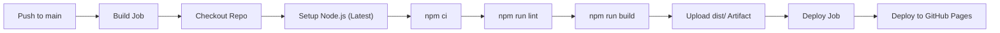

# Personal Portfolio Website

Personal portfolio website of **Shashank Raj** ([@spoiledunknown](https://github.com/spoiledunknown)), built with **Vite 8**, **Vue 3 (Composition API)**, and strict **TypeScript**, styled using the **Obsidian Glass** design system.

Live deployment: [**spoiledunknown.github.io**](https://spoiledunknown.github.io)

---

## Tech Stack & Dependencies

| Tool / Library        | Version    | Purpose                                                           |
| :-------------------- | :--------- | :---------------------------------------------------------------- |
| **Vue 3**             | `^3.5.43`  | Modern reactive UI framework utilizing `<script setup>` syntax    |
| **TypeScript**        | `^5.9.3`   | Strict static typing and type safety across data and components   |
| **Vite**              | `^8.3.0`   | Ultra-fast build tool and local development server                |
| **Tailwind CSS**      | `^4.3.3`   | Utility-first styling utilizing CSS variables and modern `@theme` |
| **@tailwindcss/vite** | `^4.3.3`   | Direct Vite plugin integration for lightning-fast CSS processing  |
| **Swiper**            | `^14.2.0`  | Touch-friendly looping slider for featured deployments & articles |
| **Web3Forms API**     | REST       | Serverless contact form transmission directly to email            |
| **hCaptcha**          | API        | Human verification bot barrier with responsive mobile scaling     |
| **ESLint**            | `^10.11.0` | Next-generation flat configuration linting                        |
| **Prettier**          | `^3.9.8`   | Code formatting consistency across Vue, TS, and CSS               |

---

## Key Features

- **Obsidian Glass Design System**: Deep obsidian surfaces (`#0d0f14`), translucent frosted cards, subtle borders, and dynamic ambient reactive backdrops.
- **System Theme Auto-Detection & Persistence**: Automatically matches the user's OS/Windows color scheme (dark/light) on first visit, responds to live OS changes, and persists manual overrides in `localStorage` without flash of unstyled content (FOUC).
- **Responsive Layout & Mobile Navigation**: Engineered from mobile screens (<360px) to ultra-wide 4K displays. Features a streamlined mobile header with an animated full-featured navigation menu.
- **Dynamic Ambient Backdrop Reactor**: Hovering project showcase cards smoothly transitions the global backdrop glow color to match the project's signature hue.
- **Netflix-Style Featured Hero Showcase**: Large cinematic featured billboard for flagship projects (_XtremeFPS Controller_) with live procedural telemetry.
- **Touch-Friendly Looping Sliders**: Looping previous and next slider controls allowing continuous carousel navigation across projects and devlog articles.
- **Universal Filter Dropdown**: High-end dropdown filter tab (`Filter: <Category>`) featuring frosted glass styling, rotating chevrons, category icons, and active checkmarks across all devices.
- **Bidirectional Scroll Reveal Engine**: Elements smoothly animate into view and hide when scrolled out of view using custom Vue directives (`v-reveal`).
- **Buttery-Smooth Hover Dynamics**: Zero-delay tactile hover states that lift naturally on enter and smoothly return on exit with custom cubic-bezier curves.
- **Theme-Adaptive Fidget Preloader**: Interactive gyroscopic fidget spinner that follows the active light or dark theme and dissolves gracefully upon asset hydration.
- **Expanding Radial Wipe Theme Transition**: Expanding circular veil with soft ambient backdrop blur that smoothly paints theme swaps at full screen coverage.
- **Zero Heavy Backend Overhead**: Pure client-side static Single Page Application (SPA) deployable effortlessly to GitHub Pages.
- **Single Source of Truth**: All profile details, projects, skills, and blogs live in typed data files under `src/data/`.

---

## Architecture & Design System

### Architectural Tenets

- **Pure Client-Side Static Single Page Application (SPA)**: Operates entirely as pre-compiled static HTML/CSS/JS deployable to GitHub Pages, Netlify, or any static host.
- **Single Source of Truth**: All dynamic content (bio, skills, projects, blogs, theme colors) is decoupled from UI presentation into typed data files in `src/data/` and `src/theme/`.
- **System Preference Intelligence**: Synchronizes with Windows/macOS/Linux system theme (dark/light) on initial arrival, responds to OS theme shifts, and preserves explicit user overrides across sessions.

### Centralized Colors (`src/theme/colors.ts`)

Colors are declared as strongly-typed design tokens:

- **Primary Blue Accent**: `#2d68ff`
- **Secondary Coral**: `#df0042` / `#ffb3b6`
- **Tertiary Orange**: `#ca4c00` / `#ffb597`
- **Obsidian Surface**: `#0d0f14`
- **Light Surface**: `#f8fafc`

### Automatic OS Theme Detection (`src/composables/useTheme.ts`)

1. **Initial Visit**: Inspects `window.matchMedia("(prefers-color-scheme: dark)")`. If the user's operating system is set to light mode, the website initializes in light mode; if dark mode, it initializes in dark mode.
2. **Persistence**: When the user clicks the theme toggle button, the preference is saved in `localStorage.getItem("spoiledunknown-theme")`.
3. **Early Anti-FOUC (Flash of Unstyled Content)**: An inline script in `index.html` evaluates the theme before HTML rendering, ensuring zero white/dark flash on page reload.

---

## Motion, Scroll Reveal & Smooth Hover Dynamics

### 1. Buttery-Smooth Hover Engine (Zero-Delay Tactile Feedback)

All interactive cards and elements feature tailored zero-lag hover states that lift naturally on enter and smoothly return on exit:

- **Skills Cards**: Staggered scroll-reveal delays (`calc(var(--stagger) * 45ms)`) are immediately reset to `0s !important` upon reveal (`.reveal-skills.is-revealed .skill-card-item:hover` and `:not(:hover)`). Hovering triggers a silky `-6px` lift, 1.025 scale, border glow (`rgba(45, 104, 255, 0.45)`), and electric bloom box-shadow with a 400ms `cubic-bezier(0.16, 1, 0.3, 1)` transition curve.
- **Projects Billboard & Slider Cards**: Smooth 400ms `cubic-bezier(0.16, 1, 0.3, 1)` hover lift (`-8px`), 1.015 scale, and 700ms image zoom (`scale-[1.03]`).
- **Blogs Spotlight & Technical Archive Cards**: 700ms ease-out billboard glow, 400ms slider card elevation, and smooth carousel arrows.
- **Contact Social Channels**: 400ms ease-out `-1.5px` lift, scale `1.02`, and dynamic SVG icon scaling (`scale-115` + `-3deg` tilt).
- **Hero & About Profile Portraits**: 500ms ease-out micro-scale (`scale-108`) with electric border luminescence.
- **Navigation Dock & Header Actions**: 300ms ease-out scale and rotation on theme toggle and resume buttons.

### 2. Scroll Reveal & Hide Engine (`src/directives/vReveal.ts`)

The application features a GPU-accelerated scroll reveal and hide engine driven by a custom Vue directive (`v-reveal`) and native `IntersectionObserver`:

- **Bidirectional Scroll Responsiveness**: Elements animate in smoothly when scrolling into the viewport, and gently hide when scrolled out of view.
- **`v-reveal:base` (General Animation)**: Applied to Hero, About, and Contact. Smooth vertical translation (`translateY(28px)`), subtle scale (`0.98 -> 1`), and soft blur dissolution (`4px -> 0px`).
- **`v-reveal:projects` (Special Projects Animation)**: 3D perspective horizon tilt (`perspective(1200px) rotateX(7deg) translateY(45px) scale(0.94)`), expanding smoothly into full focus with cascading staggered deployment cards.
- **`v-reveal:skills` (Special Skills Animation)**: High-tech matrix pop with staggered 3D card tilt (`translateY(24px) scale(0.88) rotateY(-8deg)`) and spring cubic-bezier curves.
- **`v-reveal:blogs` (Special Blogs Animation)**: Editorial lateral parchment reveal where the spotlight essay glides in from the left (`translateX(-36px)`) and archive articles cascade from the right (`translateX(32px)`).
- **Accessibility**: Automatically disables transforms and blurs when `prefers-reduced-motion: reduce` is enabled.

### 3. Animated Fidget Preloader (`src/components/Preloader.vue`)

- Interactive gyroscopic fidget spinner with dynamic physics that responds to drag, flick, and clicks.
- Follows the active theme (clean `#F8FAFC` light canvas with blue/emerald accents or obsidian `#0D0F14`).
- Configurable artificial delay constant: `PRELOADER_MIN_DURATION_MS = 5000` (easily editable in code).
- Waits for both the 5-second minimum timer and true document/font readiness before dissolving over 950ms via `<Transition name="preloader-fade">`.

### 4. Expanding Wipe Theme Transition (`src/components/ThemeTransition.vue`)

- Triggers a circular radial wipe overlay paired with smooth fade-in and fade-out effects on the backdrop scrim.
- Controlled via `THEME_TRANSITION_TIMINGS` in `src/composables/useTheme.ts`.
- Automatically locks viewport scroll position during the transition to guarantee the page stays at the active section.

---

## Project Structure

```text
spoiledunknown.github.io/
├── .github/
│   └── workflows/
│       └── static.yml           # 2-stage CI/CD pipeline (Build & Deploy to Pages)
├── public/                      # Static assets served as-is at root
│   ├── links/                   # Social media icon SVGs (GitHub, Discord, etc.)
│   ├── mypic.webp               # About section profile portrait
│   ├── pfp.webp                 # Hero section avatar
│   ├── XtremeFPS.webp           # Project showcase media
│   ├── Richcord.webp            # Project showcase media
│   ├── newtya.webp              # Project showcase media
│   ├── cube.webp                # Project showcase media
│   └── spoiledunknown.ico       # Favicon
├── src/
│   ├── assets/
│   │   └── main.css             # Tailwind v4 import, theme tokens, and overrides
│   ├── components/              # Vue UI components
│   │   ├── HeaderNav.vue        # Floating pill navigation dock + mobile menu
│   │   ├── HeroSection.vue      # Cinematic greeting, typewriter, and photo
│   │   ├── AboutSection.vue     # Technical narrative and enlarged portrait
│   │   ├── SkillsSection.vue    # Animated skills grid with mobile dropdown
│   │   ├── ProjectsSection.vue  # Netflix-style billboard + looping carousel
│   │   ├── BlogsSection.vue     # Universal dropdown filter + article slider
│   │   ├── ContactSection.vue   # Web3Forms + responsive scaled hCaptcha
│   │   ├── FooterSection.vue    # Responsive cultural signature & copyright
│   │   ├── Preloader.vue        # Animated interactable fidget preloader
│   │   └── ThemeTransition.vue  # Circular expanding wipe theme transition
│   ├── composables/             # Reusable business logic
│   │   ├── useTheme.ts          # Dark/light theme state, OS detection & storage
│   │   ├── useTypewriter.ts     # Configurable text cycling typewriter engine
│   │   └── useScrollSpy.ts      # Active viewport section intersection tracker
│   ├── data/                    # Centralized content files
│   │   ├── profile.ts           # Bio, social links, resume URL, Web3Forms key
│   │   ├── skills.ts            # Categorized technical competencies
│   │   ├── projects.ts          # Deployments, descriptions, tags, ambient glow
│   │   └── blogs.ts             # Technical articles, devlogs, and tags
│   ├── directives/
│   │   └── vReveal.ts           # Custom scroll reveal directive
│   ├── theme/
│   │   └── colors.ts            # Centralized color theme palette definitions
│   ├── types/
│   │   └── index.ts             # TypeScript definitions and interfaces
│   ├── App.vue                  # Main application container & ambient reactor
│   └── main.ts                  # Vue application bootstrap entry
├── index.html                   # HTML template with anti-FOUC script & fonts
├── package.json                 # Dependencies and execution scripts
├── tsconfig.json                # TypeScript project configuration
└── vite.config.ts               # Vite configuration
```

---

## Component Directory & Highlights

### 1. `HeaderNav.vue`

- **Desktop**: Mathematically centered floating pill navbar with active section indicators, icon-only resume link, and rotating theme toggle.
- **Mobile (< 768px)**: Streamlined header with brand identity and a single hamburger button opening an animated menu with direct navigation, theme toggle, and resume link.

### 2. `HeroSection.vue`

- Welcoming cultural headline (`नमस्ते (Namaste)`).
- Profile avatar with active status pip and ambient border glow.
- `useTypewriter` engine cycling smoothly between technical specialties.
- Tactile CTA buttons with smooth hover scaling and shadow bloom.

### 3. `AboutSection.vue`

- Prominent enlarged photo (`mypic.webp`) showcasing identity clearly.
- Telemetry summary card highlighting starting year, self-taught systems architecture, and current engineering focus (MEVN & Unity).

### 4. `SkillsSection.vue`

- Filterable technical stack cards with icon badges and proficiency tags.
- Dedicated mobile dropdown selector to switch stack categories without horizontal clutter.
- Staggered entrance animations and zero-delay tactile hover states.

### 5. `ProjectsSection.vue`

- **Spotlight Featured Billboard**: Netflix-inspired banner for flagship project (_XtremeFPS Controller_).
- **Curated Deployment Slider**: Infinite looping Swiper/CSS carousel allowing continuous navigation left or right.
- **Dynamic Ambient Reactor**: Hovering a project card emits the project's signature hue to the global atmospheric backdrop.

### 6. `BlogsSection.vue`

- **Universal Filter Dropdown**: High-end dropdown filter tab (`Filter: <Category>`) featuring frosted glass styling, rotating chevrons, category icons, and active checkmarks across all devices.
- **Looping Archive Slider**: Looping previous and next controls for cycling through devlogs and architectural essays.

### 7. `ContactSection.vue`

- Web3Forms API integration submitting via `multipart/form-data`.
- **Responsive hCaptcha Scaler**: Prevents the fixed-width (303px) hCaptcha iframe from breaking out of the container on narrow phone screens using adaptive CSS scaling.
- 1-click clipboard email address copy with feedback status.
- 6 dedicated social cards with brand-tinted hover states.

### 8. `FooterSection.vue`

- Clean responsive layout that never clips or requires horizontal scrolling on mobile.
- Displays copyright notice, Indian flag signature (`नमस्ते 🇮🇳`), social links, and a smooth back-to-top button.

### 9. `Preloader.vue`

- Interactable fidget-like animated loading sequence with gyroscopic physics.
- Dynamically adapts to the active theme (light or dark mode).
- Configurable delay timer (`PRELOADER_MIN_DURATION_MS = 5000`).
- Dissolves smoothly over 950ms via Vue `<Transition name="preloader-fade">`.

### 10. `ThemeTransition.vue`

- Fades in a soft backdrop blur and springs the celestial glyph indicator into view.
- Circular radial wipe expands to 100% viewport coverage, safely paints the DOM theme swap, and dissolves gracefully.

---

## Centralized Data & Content Management

All website content is decoupled from component code. You can update your entire portfolio by editing data files in `src/data/`:

### Modifying Profile & Contact Info (`src/data/profile.ts`)

```typescript
export const profileData: Profile = {
  name: "Shashank Raj",
  handle: "@spoiledunknown",
  email: "your-email@example.com",
  web3Forms: {
    accessKey: "YOUR-WEB3FORMS-ACCESS-KEY",
    fromName: "Portfolio Contact Form",
  },
  resumeUrl: "https://your-resume-link.pdf",
};
```

### Modifying Projects (`src/data/projects.ts`)

```typescript
export const projectsData: Project[] = [
  {
    id: "my-project",
    title: "Project Title",
    tagline: "Short descriptive subtitle",
    description: "Detailed description of what the project does...",
    tags: ["Vue 3", "TypeScript", "Tailwind"],
    image: "/my-project.webp",
    githubUrl: "https://github.com/...",
    liveUrl: "https://...",
    ambientColor: "#2d68ff", // Ambient glow color
    featured: true,
  },
];
```

### Modifying Skills (`src/data/skills.ts`)

```typescript
export const skillsData: Skill[] = [
  {
    name: "TypeScript",
    category: "languages",
    level: "Advanced",
    icon: "code", // Material Symbol name
    description: "Strict typing and modern enterprise architecture",
  },
];
```

### Modifying Blogs (`src/data/blogs.ts`)

```typescript
export const blogsData: BlogArticle[] = [
  {
    id: "post-id",
    title: "Post Title",
    summary: "Brief synopsis...",
    category: "game-arch", // game-arch, full-stack, graphics, devlog
    date: "May 2026",
    readTime: "5 min read",
    url: "https://...",
  },
];
```

---

## Contact Form & Mobile Responsiveness Engineering

### Submission Flow

1. The user fills in their Name, Email, Subject, and Message.
2. They complete the hCaptcha challenge.
3. Upon clicking **Submit Message**, the form converts inputs into a standard `FormData` payload including `h-captcha-response`.
4. The request is dispatched via POST to `https://api.web3forms.com/submit`.
5. Upon success:
   - Live success indicator is displayed.
   - The form fields reset automatically.
   - The hCaptcha widget resets via `window.hcaptcha.reset()`.

### The hCaptcha Mobile Sizing Solution

Standard hCaptcha embeds inside an `iframe` hardcoded to `303px` width. On screens below 380px width, standard container padding causes the widget to overflow its card boundary horizontally.

To solve this:

1. **Container Padding Reduction**: Mobile padding was lowered from `p-6` to `p-4` on both the outer glass card and the inner form card.
2. **Responsive CSS Scaler**:
   ```css
   .hcaptcha-responsive-scaler {
     display: flex;
     justify-content: center;
     align-items: center;
     max-width: 100%;
     transform-origin: center center;
   }
   @media (max-width: 420px) {
     .hcaptcha-responsive-scaler {
       transform: scale(0.88);
     }
   }
   @media (max-width: 360px) {
     .hcaptcha-responsive-scaler {
       transform: scale(0.78);
     }
   }
   @media (max-width: 330px) {
     .hcaptcha-responsive-scaler {
       transform: scale(0.72);
     }
   }
   ```
3. **Result**: The form maintains identical boundaries to the main navigation menu across all mobile devices (from iPhone SE at 320px to large 4K displays).

---

## Development & Build

### Requirements

- Node.js 22+ (or latest)
- npm 10+

### Installation

```bash
git clone https://github.com/spoiledunknown/spoiledunknown.github.io.git
cd spoiledunknown.github.io
npm install
```

### Development Server

```bash
# Start local development server with Hot Module Replacement (HMR)
npm run dev
```

### Production Build

```bash
# Perform type-checking and build production bundle into dist/
npm run build
```

Generates optimized static assets inside `dist/`.

### Preview Build

```bash
# Preview production build locally
npm run preview
```

### Linting & Formatting

```bash
npm run lint          # Run ESLint across TypeScript and Vue files
npm run lint-fix      # Automatically fix ESLint issues
npm run format        # Format code with Prettier
npm run format-check  # Verify Prettier compliance
```

---

## CI/CD Pipeline (GitHub Actions)

The website utilizes a 2-stage automated GitHub Actions workflow (`.github/workflows/static.yml`):



### Key Highlights

- **Latest Node.js Engine**: Configured with `node-version: "latest"` utilizing `actions/setup-node@v4` with automatic npm package caching.
- **Quality Gates**: Runs `npm run lint` and `vue-tsc` type-checking before bundling.
- **Production Optimization**: Executes `vite build` to output gzip-optimized static assets to `./dist`.
- **Atomic Deployment**: Uploads only `./dist` using `actions/upload-pages-artifact@v3` and deploys seamlessly with `actions/deploy-pages@v4`.

---

## License

Personal portfolio repository. Source code is open for personal reference.
